<div align="center">


<h1>Letopisec</h1>

_Data collection server for CF3D CAN black box recorders_

[](https://github.com/Zubax/letopisec/actions/workflows/ci.yml)
[](https://zubax.com/)
[](https://forum.zubax.com)

</div>

Zubax CANFace CF3D CAN bus data loggers collect CAN frames into on-device persistent storage, like a black box flight recorder, and store them until wireless connectivity to a predefined network becomes available (e.g., during vehicle service or maintenance). As soon as connectivity is available, the CAN frames collected during the offline period are uploaded in FIFO order to the data collection server. Every frame that is confirmed to be received by the server is erased from the device, enabling completely unattended continuous persistent data collection across the entire fleet of vehicles. The on-board storage is large enough to store at least multiple days or weeks worth of data with highly robust FEC encoding to avoid loss or damage.

This project implements the data collection server of this system. It is a simple Python application that exposes a REST API that is used by dataloggers to upload data when within reach of the wireless network, and by clients to review and fetch stored data of interest (with rich filters). This system enables advanced diagnostics, postmortem analysis, predictive maintenance, and data mining at scale across the entire fleet, without the need to manually collect data per vehicle, as long as each vehicle appears within the range of a predefined wireless network at least intermittently.

The server can be deployed in airgapped networks, ensuring 100% locality and security of the collected datasets. Ingest scripts are available to bulk upload data from datalogger memory cards directly in case of damage (e.g., following accidents where the vehicle is damaged or destroyed). The data is stored in a simple SQLite database that can also be accessed directly for more advanced usage.

```mermaid
graph TD
    CAN["🔌 CAN bus<br/>every frame from every ECU"] --> CF3D

    subgraph FLEET["✈️ 🚗 🚢 Vehicles"]
        CF3D["CF3D Black Box Recorder<br/><i>on-device storage<br/>weeks of data</i>"]
    end

    CF3D == "📡 auto-upload over Wi-Fi<br/>during service/maintenance<br/>fully unattended" ==> COMMIT

    subgraph LETOPISEC["💾 Letopisec Server"]
        COMMIT["Ingest<br/>FEC repair records"] --> DB[("SQLite<br/>append-only · idempotent<br/>airgap-safe")]
        DB --> API["REST API<br/>devices · boots · records<br/>filtering · long-polling"]
    end

    COMMIT -. "☑️ ACK<br/>device erases confirmed records" .-> CF3D

    API ==> D["Diagnostics"]
    API ==> P["Postmortem<br/>Analysis"]
    API ==> M["Predictive<br/>Maintenance"]
    API ==> F["Fleet-Scale<br/>Data Mining"]

    classDef can fill:#e2e8f0,stroke:#475569,color:#1e293b
    classDef recorder fill:#880000,stroke:#FF0000,color:#fff,font-weight:bold
    classDef ingest fill:#d1fae5,stroke:#059669,color:#064e3b
    classDef db fill:#059669,stroke:#047857,color:#fff,font-weight:bold
    classDef api fill:#d1fae5,stroke:#059669,color:#064e3b
    classDef outcome fill:#fef08a,stroke:#ca8a04,color:#713f12,font-weight:bold

    class CAN can
    class CF3D recorder
    class COMMIT ingest
    class DB db
    class API api
    class D,P,M,F outcome
```



For details, please reach out to <sales@zubax.com>.

## Usage

Install and run the server at the default endpoint <http://0.0.0.0:8000>

```bash
pip install letopisec   # For development, use `pip install -e .` for editable installation
letopisec serve         # See --help for extra info.
```

Open the API docs at the `/docs` endpoint in your browser, e.g., <http://localhost:8000/docs>.

Run behind a local gateway via Unix socket:

```bash
letopisec serve --uds /run/letopisec/letopisec.sock
```

Every runtime option can be configured with env vars like `LETOPISEC_HOST`/`.._PORT`, `LETOPISEC_DB_PATH`, etc.
CLI arguments override environment values.

### Store and retrieve CAN frames

Configure Zubax CANFace CF3D devices to use the endpoint where the server is running.
Existing dumps from CF3D memory cards can also be uploaded manually using [`letopisec_ingest.py`](tools/letopisec_ingest.py).

### Gateway integration

You can run the ASGI app through an external process manager/gateway using the app factory:

```bash
export LETOPISEC_DB_PATH=/var/lib/letopisec/letopisec.db
export LETOPISEC_LOG_FILE=/var/log/letopisec/server.log
export LETOPISEC_LOG_LEVEL=INFO
uvicorn --factory letopisec.server:create_app_from_env
```

## API endpoints

`POST /cf3d/api/v1/commit` - Upload one or more binary CF3D records; the first HTTP response line is the cumulative ACK (`last_seqno`).
This is the endpoint that is invoked by dataloggers to transfer previously recorded CAN frames from their internal storage.

`GET /cf3d/api/v1/devices` - List known devices with their latest heartbeat time (`last_heard_ts`) and last seen hardware UID (`last_uid`).
Use this to see which dataloggers have committed their data and when each was last seen online.

`GET /cf3d/api/v1/boots` - List boot sessions for a device, including first/last record per boot, with optional commit-time window filtering.

`GET /cf3d/api/v1/records` - Fetch records for a device and one or more boot IDs, with optional seqno bounds and long-polling for real-time streaming.

### Manual invocation

The REST API is very simple and can be exercised manually using wget or similar tools. Examples (`jq` is added for nicer formatting):

```bash
wget -qO- "http://localhost:8000/cf3d/api/v1/devices" | jq
```

```bash
wget -qO- "http://localhost:8000/cf3d/api/v1/boots?device=my+device" | jq
```

```bash
wget -qO- "http://localhost:8000/cf3d/api/v1/records?device=my+device&boot_id=1" | jq
```
